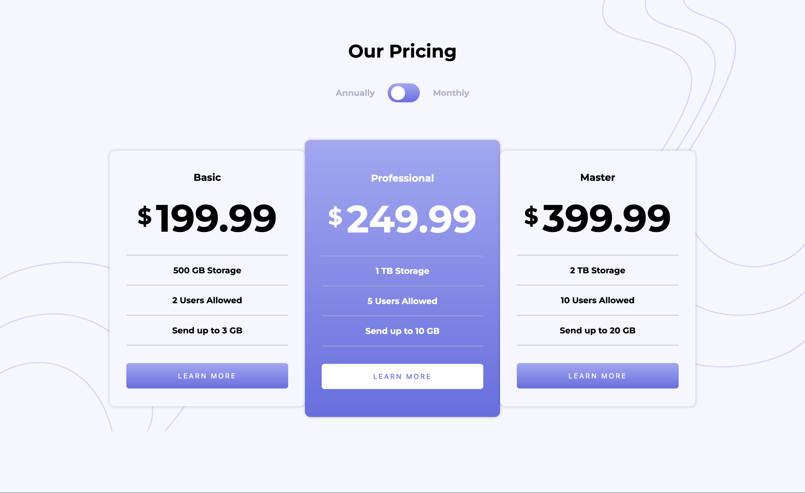

# Frontend Mentor - Pricing component with toggle solution

This is a solution to the [Pricing component with toggle challenge on Frontend Mentor](https://www.frontendmentor.io/challenges/pricing-component-with-toggle-8vPwRMIC). Frontend Mentor challenges help you improve your coding skills by building realistic projects. 

## Table of contents

- [Overview](#overview)
  - [The challenge](#the-challenge)
  - [Screenshot](#screenshot)
  - [Links](#links)
- [My process](#my-process)
  - [Built with](#built-with)
  - [What I learned](#what-i-learned)
  - [Continued development](#continued-development)
  - [Useful resources](#useful-resources)

## Overview

### The challenge

Users should be able to:

- View the optimal layout for the component depending on their device's screen size
- Control the toggle with both their mouse/trackpad and their keyboard
- **Bonus**: Complete the challenge with just HTML and CSS

### Screenshot



### Links

- Live Site URL: [Pricing Toggle with Sass](https://tsune-web.github.io/FM-pricing-toggle-with-sass/)

## My process

### Built with

- Semantic HTML5 markup
- CSS custom properties
- Flexbox
- CSS Grid
- Mobile-first workflow
- SCSS

### What I learned

```js
const checkBox = document.getElementsByTagName("input"); // input[type="checkbox"]
checkBox.target.checked;  // return a boolean value, initially false
```

### Continued development

- Sass/ scss:
  For this challenge, I used variables, nesting, partials, modules, and mixins while doing research on how to implement them. I haven't used mathematical styling in css so that'll be interesting to know and be more efficient for responsive design.

- JavaScript - interactive components:
  This challenge involves simple toggle effects, but it was fun to implement the functionality. Not only the toggle functionality, I'd like to know and be able to create more advanced applications with JavaScript.

### Useful resources

- [The most common HTML mistake that I see - Kevin Powell YouTube](https://www.youtube.com/watch?v=NexL5_Vdoq8) - This helped me for HTML structure and how to use tags with their specific meaning. 
- [Toggle Switch - GeeksforGeeks](https://www.geeksforgeeks.org/how-to-create-toggle-switch-by-using-html-and-css/) - This website shows how to create toggle switch with examples. (also see [Toggle Switch - W3School](https://www.w3schools.com/howto/howto_css_switch.asp))
- [Sass](https://sass-lang.com/) - This is an official website of Sass with readable documentation.
